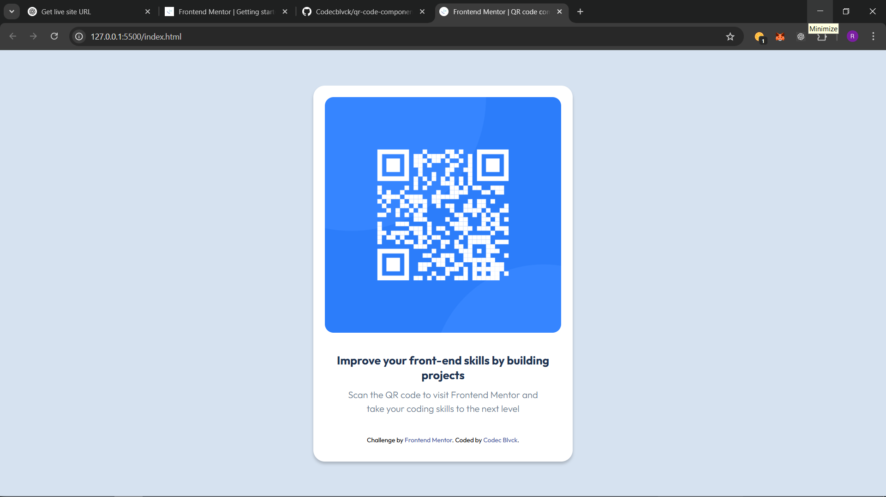

# Frontend Mentor - QR code component solution

This is a solution to the [QR code component challenge on Frontend Mentor](https://www.frontendmentor.io/challenges/qr-code-component-iux_sIO_H). Frontend Mentor challenges help you improve your coding skills by building realistic projects. 

## Table of contents
<!-- -->
- [Overview](#overview)
  - [Screenshot](#screenshot)
  - [Links](#links)
- [My process](#my-process)
  - [Built with](#built-with)
  - [What I learned](#what-i-learned)
  - [Continued development](#continued-development)
  - [Useful resources](#useful-resources)
- [Author](#author)


## Overview

### Screenshot



### Links

- Solution URL: [Add solution URL here](https://your-solution-url.com)
- Live Site URL: [Add live site URL here](https://your-live-site-url.com)

## My process

### Built with

- Semantic HTML5 markup
- CSS custom properties
- Flex-box

### What I learned

- Flex-box for Centering Layouts:
I learned how to use display: flex along with justify-content and align-items to center elements both horizontally and vertically. This made my layout look clean and centered on any screen size.

 ```css
body {
  display: flex;
  justify-content: center;
  align-items: center;
  height: 100vh;
}
 ```
- Responsive Design with Media Queries:
I practiced using media queries to adjust layout and font sizes for different screen sizes, ensuring that the design remains readable and balanced across devices.

 ```css 
 @media (min-width: 1440px) 
 { .container { max-width: 400px; } }
  ```
 - Typography and Spacing:
I paid attention to font sizing, weight, and line-height to improve readability. I also learned how important consistent spacing (margins and padding) is to visual clarity.

- Reusable CSS and Clean Structure:
I focused on organizing my CSS well—grouping styles logically, avoiding repetition, and using consistent naming to keep the file readable and scalable.

- Visual Polish with Transitions:
I experimented with adding small hover effects and transitions to improve user interaction and give the design a more refined look.


### Continued development

**here are some areas i would like to continue learning**

- Responsive Design: Continue improving layout adaptability across all screen sizes.

- Typography: Refine font scaling and hierarchy for better readability.

Spacing & Layout: Practice consistent padding and margins for cleaner designs.

- CSS Structure: Write modular, reusable, and organized CSS.

- Transitions: Use subtle hover effects to enhance user experience.

### Useful resources

- [CSS Flex-box Guide-CSS Tricks](https://css-tricks.com/snippets/css/a-guide-to-flexbox/) - This guide helped me understand how to use Flex-box to center elements both horizontally and vertically. The visuals made it easy to grasp how each property behaves.


- [Responsive Web Design Basics – MDN Web Docs](https://developer.mozilla.org/en-US/docs/Learn/CSS/CSS_layout/Responsive_Design) - This article was essential for learning how to make layouts responsive using media queries. I’ll definitely refer back to it in future projects.

## Author

- Frontend Mentor - [@Codecblvck](https://www.frontendmentor.io/profile/Codecblvck)
- Twitter - [@Codec_blvck](https://x.com/Codec_blvck)


